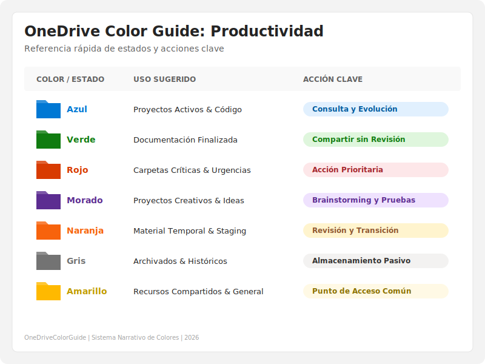

# 📘 OneDriveColorGuide

## 🌟 Visión
Este proyecto nace como respuesta a la incorporación de la funcionalidad nativa de coloreado de carpetas en OneDrive (Windows 11). Busca convertir la organización de carpetas en **un sistema narrativo y visual**, donde cada color representa un estado, propósito o emoción. La meta es que cualquier persona pueda entender la estructura de un vistazo, aprovechando al máximo esta nueva capacidad.

## 🎯 Propósito
Este proyecto establece un **esquema narrativo de colores** para organizar carpetas en OneDrive, transformándolas en un **mapa visual que guía y da significado** a tu documentación y repositorios. Busca:

- **Simplificar la navegación**: Facilitar la comprensión del propósito y estado de cada carpeta a primera vista.
- **Mejorar la resonancia emocional**: Conectar el uso de colores con la función práctica y el impacto emocional de cada espacio digital.
- **Ofrecer una guía modular**: Permitir que equipos y usuarios apliquen un sistema consistente y expandible para una organización digital más intuitiva.

## 🗂️ Estructura

```
OneDriveColorGuide/
├── README.md              ← Guía principal (visión, propósito, uso)
├── docs/                  ← Documentos escritos
│   ├── onedrive-color-guide.md ← Guía detallada de uso
│   └── future-roadmap.md  ← Ideas y evolución
├── infographics/          ← Material visual (SVG/PNG)
│   ├── productivity-grid.svg ← Guía rápida de productividad
│   ├── emotional-map.svg    ← Mapa narrativo emocional
│   └── quick-guide.png      ← Versión minimalista
├── examples/              ← Casos prácticos
│   ├── folder-structure.md
│   └── screenshots/       ← Capturas de aplicación real
└── assets/                ← Recursos compartidos
    ├── icons/             ← Íconos para guías
    └── templates/         ← Plantillas reutilizables
```

## 🖼️ Recursos Visuales
Hemos diseñado dos herramientas visuales para facilitar la adopción del sistema:

| **The Productivity Grid** | **The Emotional Map** |
| :---: | :---: |
| [](infographics/productivity-grid.svg) | [](infographics/emotional-map.svg) |
| *Ideal para consulta técnica rápida.* | *Ideal para entender la narrativa emocional.* |

## 🚀 Uso
Para una aplicación efectiva y consistente de este sistema, consulta [la Guía completa de Colores para OneDrive](docs/onedrive-color-guide.md). A modo de resumen, te recomendamos:

1. Aplica el color correspondiente a cada carpeta según su estado y propósito.  
2. Mantén la consistencia: un color siempre debe significar lo mismo para evitar confusiones.  
3. Utiliza esta guía como referencia principal en **onboarding** y para la creación de **manuales internos**.

## 🔮 Futuro
- Añadir ejemplos prácticos con capturas o infografías.  
- Extender el sistema a otros espacios (naming, iconografía, infografías).  
- Iterar con feedback del equipo para mantenerlo como **documentación viva**.  
